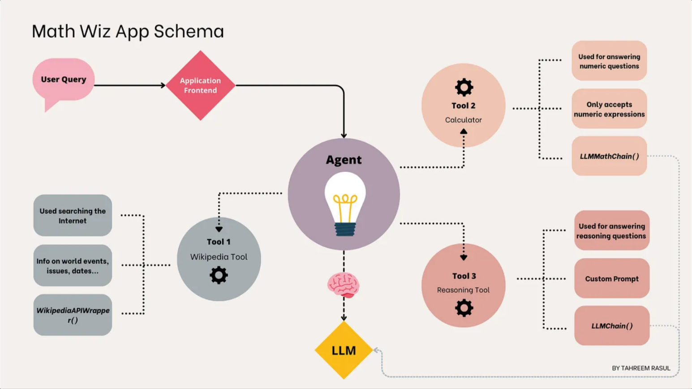
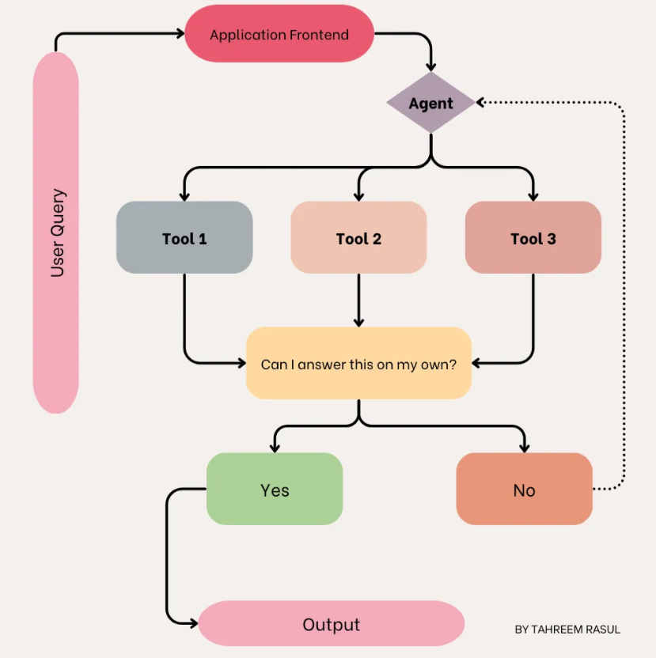
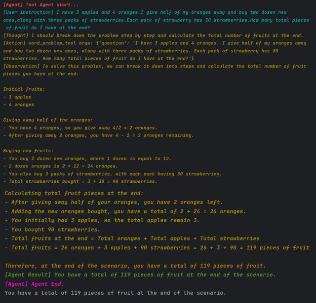
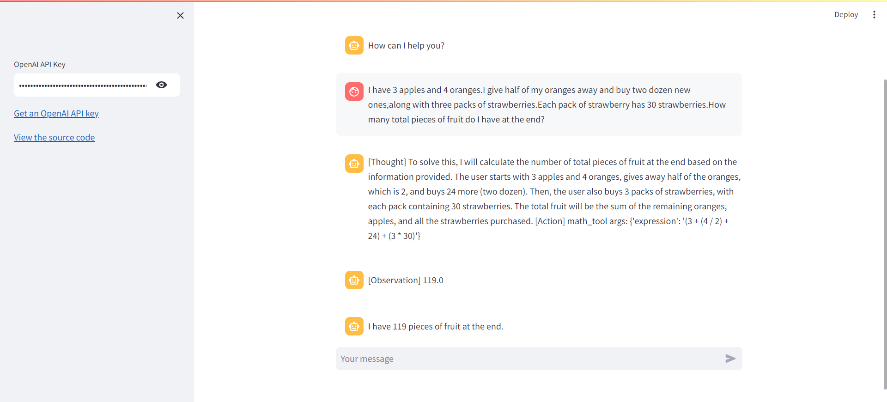

# Building a Math Application with promptulate Agents
This demo is how to use promptulate agents to create a custom Math application utilising OpenAI's GPT4 Model.
For the application frontend, there will be using streamlit, an easy-to-use open-source Python framework. 
This generative math application, let’s call it “Math Wiz”, is designed to help users with their math or reasoning/logic questions.

the app schema for “Math Wiz” looks like the following:


## Environment Setup
We can start off by creating a new conda environment with python=3.11:`conda create -n math_assistant python=3.11`

Activate the environment:`conda activate math_assistant`

Next, let’s install all necessary libraries:
- `pip install -U promptulate` 

- `pip install wikipedia`

- `pip install numexpr`

Sign up at OpenAI and obtain your own key to start making calls to the gpt model. Once you have the key, create a .env file in your repository and store the OpenAI key:


```python
OPENAI_API_KEY="your_openai_api_key"
```

## Application Flow
The application flow for Math Wiz is outlined in the flowchart below. The agent in our pipeline will have a set of tools at its disposal that it can use to answer a user query. The Large Language Model (LLM) serves as the “brain” of the agent, guiding its decisions. When a user submits a question, the agent uses the LLM to select the most appropriate tool or a combination of tools to provide an answer. If the agent determines it needs multiple tools, it will also specify the order in which the tools are used.


**The application flow for Math Wiz is outlined below:**

The agent in our pipeline will have a set of tools at its disposal that it can use to answer a user query. The Large Language Model (LLM) serves as the “brain” of the agent, guiding its decisions. When a user submits a question, the agent uses the LLM to select the most appropriate tool or a combination of tools to provide an answer. If the agent determines it needs multiple tools, it will also specify the order in which the tools are used.

The agent for our Math Wiz app will be using the following tools:

1. **Wikipedia Tool:** this tool will be responsible for fetching the latest information from Wikipedia using the Wikipedia API. While there are paid tools and APIs available that can be integrated inside Promptulate, I would be using Wikipedia as the app’s online source of information.

2. **Calculator Tool:** this tool would be responsible for solving a user’s math queries. This includes anything involving numerical calculations. For example, if a user asks what the square root of 4 is, this tool would be appropriate.

3. **Reasoning Tool:** the final tool in our application setup would be a reasoning tool, responsible for tackling logical/reasoning-based user queries. Any mathematical word problems should also be handled with this tool.

Now that we have a rough application design, we can begin thinking about building this application.

## Understanding promptulate Agents

Promptulate agents are designed to enhance interaction with language models by providing an interface for more complex and interactive tasks. We can think of an agent as an intermediary between users and a large language model. Agents seek to break down a seemingly complex user query, that our LLM might not be able to tackle on its own, into easier, actionable steps.

In our application flow, we defined a few different tools that we would like to use for our math application. Based on the user input, the agent should decide which of these tools to use. If a tool is not required, it should not be used. Promptulate agents can simplify this for us. These agents use a language model to choose a sequence of actions to take. Essentially, the LLM acts as the “brain” of the agent, guiding it on which tool to use for a particular query, and in which order. This is different from Proptulate chains where the sequence of actions are hardcoded in code. Promptulate offers a wide set of tools that can be integrated with an agent. These tools include, and are not limited to, online search tools, API-based tools, chain-based tools etc. For more information on Promptulate agents and their types, see [this](https://undertone0809.github.io/promptulate/#/modules/agent?id=agent).

## Step-by-Step Implementation 

### Step 1

Create a `chatbot.py` script and import the necessary dependencies:


```python
from promptulate.tools.wikipedia.tools import wikipedia_search
from promptulate.tools.math.tools import calculator
import promptulate as pne
```

### Step 2
Next, we will define our OpenAI-based Language Model.The architectural design of `promptulate` is easily compatible with different large language model extensions. In `promptulate`, llm is responsible for the most basic part of content generation, so it is the most basic component.By default, `ChatOpenAI` in `promptulate` uses the `gpt-3.5-turbo` model.


```python
llm = pne.LLMFactory.build(model_name="gpt-4-1106-preview")
```

We would be using this LLM both within our math and reasoning process and as the decision maker for our agent.

### Step 3
When constructing your own agent, you will need to provide it with a list of tools that it can use. Difine a tool， the only you need to do is to provide a function to Promptulate. Promptulate will automatically convert it to a tool that can be used by the language learning model (LLM). The final presentation result it presents to LLM is an OpenAI type JSON schema declaration.

Actually, Promptulate will analysis function name, parameters type, parameters attribution, annotations and docs when you provide the function. We strongly recommend that you use the official best practices of Template for function writing. The best implementation of a function requires adding type declarations to its parameters and providing function level annotations. Ideally, declare the meaning of each parameter within the annotations.

We will now create our three tools. The first one will be the online tool using the Wikipedia API wrapper:


```python
# Wikipedia Tool
def wikipedia_tool(keyword: str) -> str:
    """search by keyword in web.

    A useful tool for searching the Internet to find information on world events,
    issues, dates,years, etc. Worth using for general topics. Use precise questions.

    Args:
        keyword: keyword to search

    Returns:
        str: search result
    """
    return wikipedia_search(keyword)
```

Next, let’s define the tool that we will be using for calculating any numerical expressions. `Promptulate` offers the `calculator` which uses the `numexpr` Python library to calculate mathematical expressions. It is also important that we clearly define what this tool would be used for. The description can be helpful for the agent in deciding which tool to use from a set of tools for a particular user query. 


```python
# calculator tool for arithmetics
def math_tool(expression: str):
    """Useful for when you need to answer questions about math. This tool is only
    for math questions and nothing else. Only input math expressions.

    Args:
        expression: A mathematical expression, eg: 18^0.43

    Attention:
        Expressions can not exist variables!
        eg: (current age)^0.43 is wrong, you should use 18^0.43 instead.

    Returns:
        The result of the evaluation.
    """
    return calculator(expression)
```

Finally, we will be defining the tool for logic/reasoning-based queries. We will first create a prompt to instruct the model with executing the specific task. Then we will create a simple `AssistantMessage` for this tool, passing it the LLM and the prompt.


```python
# reasoning based tool
def word_problem_tool(question: str) -> str:
    """
    Useful for when you need to answer logic-based/reasoning questions.

    Args:
        question(str): Detail question, the description of the problem requires a
        detailed question context. Include a description of the problem

    Returns:
        question answer
    """
    system_prompt: str = """You are a reasoning agent tasked with solving t he user's logic-based questions.
    Logically arrive at the solution, and be factual.
    In your answers, clearly detail the steps involved and give the final answer.
    Provide the response in bullet points."""  # noqa
    model = pne.LLMFactory.build(model_name="gpt-4-1106-preview")
    return model(f"{system_prompt}\n\nQuestion:{question}Answer:")
```

### Step 4
We will now initialize our agent with the tools we have created above. We will also specify the LLM to help it choose which tools to use and in what order:


```python
# agent
agent = pne.ToolAgent(tools=[wikipedia_tool, math_tool, word_problem_tool],
                      llm=llm)

resp: str = agent.run("I have 3 apples and 4 oranges.I give half of my oranges away and buy two dozen new ones,along with three packs of strawberries.Each pack of strawberry has 30 strawberries.How many total pieces of fruit do I have at the end?")
print(resp)
```

    [Agent] Tool Agent start...
    [User instruction] I have 3 apples and 4 oranges.I give half of my oranges away and buy two dozen new ones,along with three packs of strawberries.Each pack of strawberry has 30 strawberries.How many total pieces of fruit do I have at the end?
    [Thought] To determine the total number of pieces of fruit, we calculate the number of remaining oranges after giving half away, then add the new oranges purchased and the total strawberries from the three packs. Apples remain constant at 3.
    [Action] word_problem_tool args: {'question': 'If a person has 4 oranges and gives half away, how many are left? They then buy 24 more oranges and acquire 3 packs of strawberries with each pack containing 30 strawberries. How many pieces of fruit do they have in total if they originally had 3 apples?'}
    [Observation] - Start with the number of oranges the person initially has: 4 oranges.
    - They give away half of these oranges, so let's calculate half of 4:
      - 4 / 2 = 2 oranges.
    - The number of oranges the person has left after giving half away is 2.
    - The person then buys 24 more oranges, so we add these to the remaining oranges:
      - 2 oranges (remaining after giving away half) + 24 oranges (bought) = 26 oranges.
    - Next, we account for the acquired strawberry packs. There are 3 packs, each with 30 strawberries.
      - 3 packs * 30 strawberries per pack = 90 strawberries.
    - The person originally had 3 apples, which we'll add to the total count of fruit:
      - 3 apples (originally had).
    - To calculate the total pieces of fruit, add the number of oranges, strawberries, and apples together:
      - 26 oranges (after transactions) + 90 strawberries (from the packs) + 3 apples (originally had) = 119 pieces of fruit.
    - Final answer: The person has 119 pieces of fruit in total.
    [Agent Result] 119
    [Agent] Agent End.
    119
    

**The app’s response to a logic question is following:**


## Creating streamlit application

We will be using Streamlit, an open-source Python framework, to build our application. With Streamlit, you can build conversational AI applications with a few simple lines of code. There is a `chatbot.py` file under the `build-math-application-agent` file of `example` in the project folder. You can run the application directly to view the effect and debug the web page. 

Project Link: [build-math-application-with-agent](https://github.com/Undertone0809/promptulate/tree/main/example/build-math-application-with-agent)

To run the application, follow the steps below:

- Click [here](https://github.com/Undertone0809/promptulate/fork) to fork the project to your local machine
- Clone the project locally:

```bash
git clone https://github.com/Undertone0809/promptulate.git
```

- Switch the current directory to the example

```shell
cd ./example/build-math-application-with-agent
```

- Install the dependencies

```shell
pip install -r requirements.txt
```

- Run the application

```shell
streamlit run chatbot.py
```

The running result is as follows:


Examples of other questions are given below for testing reference:
1. Question 1
    - I have 3 apples and 4 oranges.I give half of my oranges away and buy two dozen new ones,along with three packs of strawberries.Each pack of strawberry has 30 strawberries.How many total pieces of fruit do I have at the end?
    - correct answer = 119
2. Question 2
    - What is the cube root of 625?
    - correct answer = 8.5498
3. Question 3
    - what is cube root of 81? Multiply with 13.27, and subtract 5.
    - correct answer = 52.4195
4. Question 4
    - Steve's sister is 10 years older than him. Steve was born when the cold war 
ended. When was Steve's sister born?
    - correct answer = 1991 - 10 = 1981
5. Question 5
    - Tell me the year in which Tom Cruise's Top Gun was released, and calculate the square of that year.
    - correct answer = 1986**2 = 3944196
