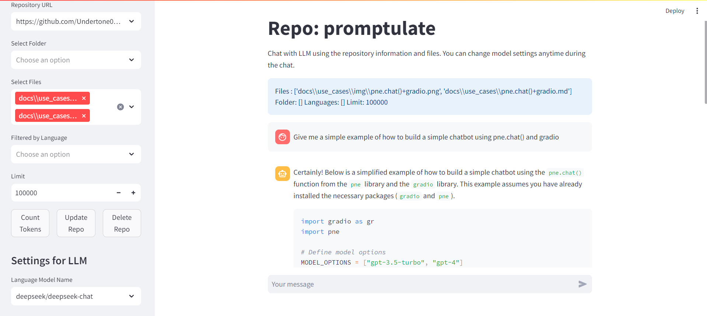

# Build a chatbot using pne-streamlit to chat with GitHub repo 
This is an example of building a chatbot for GitHub repo using streamlit and promptulate.

# Quick Start

You can use the following command to run the project quickly:

- Click [here](https://github.com/Undertone0809/promptulate/fork) to fork the project to your local machine

- Clone the project locally:

```shell
git clone https://www.github.com/Undertone0809/promptulate
```

Switch the current directory to the example

```shell
cd ./example/chat-to-github-repo
```

Install the dependencies

```shell
pip install -r requirements.txt
```

Run the application

```shell
streamlit run app.py
```
## Sample Output


# Role of each document 
1. `app.py`: This is the main entry point of the application. It uses streamlit to build a chatbot interface. The chatbot is built using promptulate. The chatbot is able to chat with GitHub repo.
2. `config.py`: This is the configuration file for the application.
3. `repo_service.py`:Provides a comprehensive code warehouse management tool to handle various operations and data processing related to the code warehouse 
4. `token_counter.py`:Two functions are defined to calculate the number of tokens 